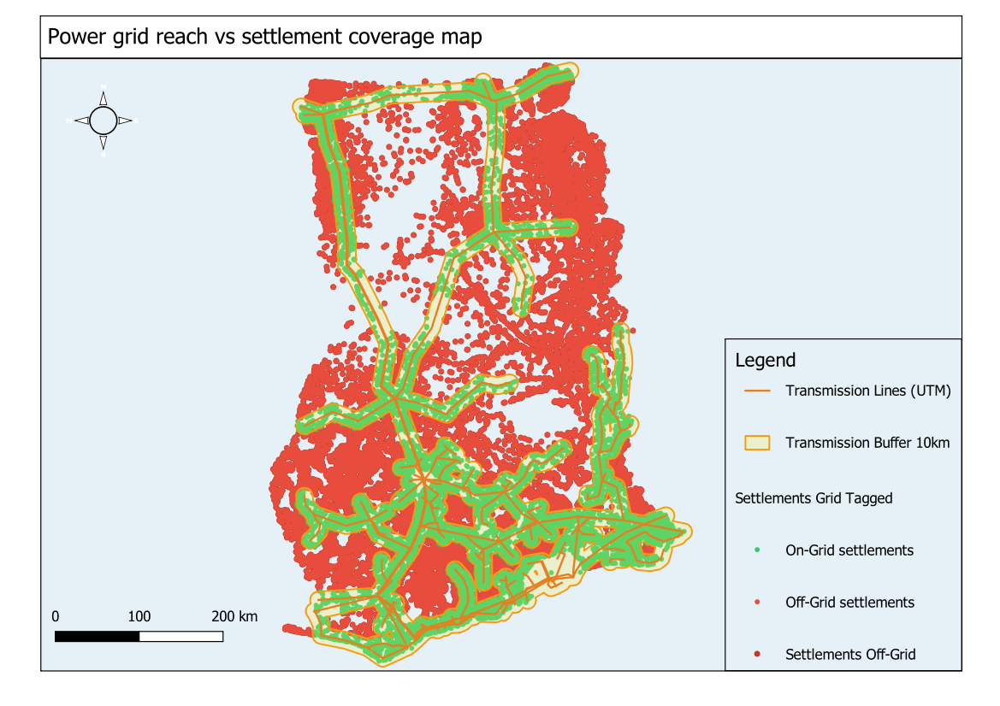

# Power Grid Reach vs Settlement Coverage Map

**Country:** Ghana
**CRS:** EPSG:25000 - Leigon / Ghana Metre Grid
**Project file:** `Power-Grid-Reach-Coverage.qgz`

---

## Overview

This project assesses how many of Ghana's settlements fall within reach of the national electricity transmission network. A 10 km buffer is applied to transmission lines to approximate grid service zones, and settlements are tagged as on-grid or off-grid based on whether they fall within this corridor. The off-grid settlement layer identifies communities where distributed energy solutions remain the most viable electrification pathway.

## Reference Layout

---

## Objectives

- Buffer the transmission line network to a 10 km grid reach corridor.
- Tag all settlements by grid reach status (within or outside the corridor).
- Extract off-grid settlements as a priority layer for distributed energy planning.
- Retain power plant locations as supplementary reference context.

## Methodology

1. Transmission line network reprojected to EPSG:25000: `elec_transmission_utm.gpkg`.
2. A 10 km buffer applied to transmission lines: `elec_transmission_10km_buffer.gpkg`.
3. Settlements reprojected to EPSG:25000: `settlements_utm.gpkg`.
4. Settlements spatially tagged against the transmission buffer: `settlements_grid_tagged.gpkg`.
5. Settlements outside the 10 km buffer extracted as off-grid communities: `settlements_off_grid.gpkg`.
6. Power plant locations reprojected and retained as context: `power_plants_utm.gpkg`.

## Output Layers

| File | Description |
|------|-------------|
| `elec_transmission_utm.gpkg` | Transmission lines reprojected to EPSG:25000 |
| `elec_transmission_10km_buffer.gpkg` | 10 km grid reach buffer along transmission lines |
| `settlements_utm.gpkg` | All settlements reprojected to EPSG:25000 |
| `settlements_grid_tagged.gpkg` | Settlements tagged as on-grid or off-grid |
| `settlements_off_grid.gpkg` | Settlements outside 10 km of any transmission line |
| `power_plants_utm.gpkg` | Power plant locations for reference |

## Key Findings

- A large proportion of Ghana's rural settlements, particularly in the Savannah, Upper West, and Oti regions, fall outside the 10 km transmission buffer and are classified as off-grid.
- Southern and peri-urban settlements show the highest on-grid coverage, consistent with the concentration of transmission infrastructure around major load centres.
- The off-grid settlement layer provides a direct spatial input for mini-grid and solar home system programme targeting.

## Deliverables

| File | Type |
|------|------|
| `Power-Grid-Reach-Coverage.qgz` | QGIS project |
| `reference_layout.png` | Print layout reference image |

## Notes

- All layers use EPSG:25000 (Leigon / Ghana Metre Grid).
- The 10 km buffer is a proxy for grid reach; last-mile distribution line coverage and actual connection rates would provide a more precise electrification status for detailed programme design.

---

## Map Preview

